<h1 align="center">Domain Locker</h1>
<p align="center">
	<i>The Central Hub for all your Domain Names</i>
  <br>
  <b>🌐<a href="https://domain-locker.com">domain-locker.com</a></b>
</p>
<p align="center">
  
</p>

<details>
  <summary><b>Contents</b></summary>
  
  - [About](#about)
	- [Screenshot](#screenshot)
	- [Features](#features)
	- [Live Demo](#demo)
- [Get Started](#get-started)
	- [Domain-Locker.com](#option-1-domain-lockercom)
	- [Self-Hosting](#option-2-self-hosting)
- [Developing](#developing)
  - [App Setup](#project-setup)
  - [Architecture](#architecture)
- [Contributing](#contributing)
- [Attributions](#attributions)
- [License](#license)
</details>

## About

The aim of Domain Locker, is to give you complete visibility of your domain name portfolio, in once central place.

For each domain you add, we analyse it and fetch all associated data. We then continuously monitor your domains, and notify you (according to your preferences) when something important changes or when it's soon to expire. So you'll get detailed domain analysis, security insights, change history, recent performance, valuation data and much more.

With Domain Locker, you'll never again loose track of your domains, miss an expiration, or forget which registrar and providers each domain uses.

### Screenshot

<sup>(Sorry about the 5fps, I wanted to keep file size down!)</sup>

<p align="center">
<br>

</p>

<details>
<summary>More screenshots...</summary>
<p align="center">


</p>
</details>


### Features

- 👁️ Total visibility of all your domains and upcoming expirations
- 📡 Auto-fetched data: SSL certs, hosts, registrars, IPs, subdomains, DNS, etc
- 🔬 View detailed metrics and analysis for each domain
- 📊 Visual analytics and breakdowns and trends across your portfolio
- 💬 Configurable alerts and webhook notifications
- 🗃️ Easy import/export, as well as API data access
- 📜 Track changes in domain configuration over time
- 📈 Monitor website health, security and performance
- 💹 Keep record of purchase prices and renewal costs
- 🔖 Add categories, and link related resources to domains
- 🎨 Multi-language support, dark/light/custom themes

```mermaid
%%{init: {"theme": "default"}}%%
kanban
    🌐 Domain Data
        🛰️ Auto-fetch assets: SSL, hosts, registrars, IPs, DNS, subdomains
        🔎 Detailed domain data like SSL, hosts, registrars, IPs and more
        🏷️ Enrich data with tags, notes, costs, and other metadata to track
        🖇️ Connection with external tools for more data
    📊 Metrics
        🗂️ Breakdown of domain providers: registrars, SSL, hosts
        🕒 Timeline of registrations and upcoming expirations
        📶 Monitor domain uptime, performance and health
        💹 Record valuation, purchase prices and renewal costs
    🔔 Notifications
        ⏱️ Get notified before your domain is due to expire
        📲 Configurable alerts for monitoring changes in domain config
        📬 Multiple channels: webhook, email, SMS, Slack, Telegram, WhatsApp and more
        🛤️ Track change history of each domain
    🛡️ Data
        💽 Own your data: Export, import, delte at any time
        ⌨️ Programatic access via a REST or GraphQL API, or with RSS, iCal, Prometheus integrations
        📈 Keep detailed change logs of all domain updates
        🔐 Transparent privacy policy
    🛠️ Customization
        👤 SSO and 2FA supported
        🎨 Custom themes, fonts, light/dark mode
        🌍 Multi-language support
        💻 Open-source and self-hostable
        ✅ Accessible, responsive, and well-documented
```

<details>
<summary>More features...</summary>



</details>

### Demo

Try the live demo to [demo.domain-locker.com](https://demo.domain-locker.com) <br>
(Username: `demo@domain-locker.com` Password: `domainlocker`)

---

## Get Started

To use Domain Locker, you have two options:
1. 💻 The managed instance, at **[domain-locker.com](https://domain-locker.com/)** _(free)_
2. 🏗️ Or **[self-hosting](#deployment)** yourself via Docker _(also free, ofc!)_

### Option 1: Domain-Locker.com
Head to [our website](https://domain-locker.com), and sign up with Google, GitHub or your email.<br>
The starter plan is free, and no setup is required. Just sign in, add your domains, and start tracking them.

### Option 2: Self-Hosting

```bash
curl -fsSL https://install.domain-locker.com | bash
```

Use the one-liner abover, or use the [`docker-compose.yml`](https://github.com/Lissy93/domain-locker/blob/main/docker-compose.yml)

<details>
	<summary>Details</summary>

 
- **Prerequisites**:
  - Domain Locker is intended to be run in a container, so you'll need Docker [installed](https://docs.docker.com/engine/install/) on your host system.
- **Containers**:
  - We have a Docker image published to [`lissy93/domain-locker`](https://hub.docker.com/r/lissy93/domain-locker).
  - You'll also need a Postgres database, such as the [`postgres:15-alpine`](https://hub.docker.com/_/postgres?tab=tags&name=15-alpine) container.
- **Environment**:
  - When starting the container, bind `3000` in the container, to your host `PORT` (defaults to `3000`).
  - Then specify the Postgres vars: `DL_PG_HOST`, `DL_PG_PORT`, `DL_PG_USER`, `DL_PG_PASSWORD` and `DL_PG_NAME`.
- **Volumes**:
  - Mount a volume to `/var/lib/postgresql/data` to persist your Postgres data
- **Crons**
  - `/api/domain-updater` - Execute this daily, to keep domain data up-to-date and trigger notifications
  - `/api/uptime-monitor` - Execute this every N minutes, to monitor website uptime and performance
- **Example**:
  - Putting it all together, you can use our [`docker-compose.yml`](https://github.com/Lissy93/domain-locker/blob/main/docker-compose.yml) file.
  - For more details, view the [Self-Hosting Docs](https://domain-locker.com/about/self-hosting)

```mermaid
flowchart TB
  subgraph Volume Mounts
    direction TB
    Vpostgresdata([📦 postgres_data]) x-. /var/lib/postgresql/data .-x postgres[(🐘 PostgreSQL DB)]
    Vdbschemasql{{📄 ./db/schema.sql}} -. Mounted on Init .-> postgres
  end

  subgraph Network
    direction TB
    domainlockernetwork[/🌐 domain_locker_network/]
  end

  postgres -.- domainlockernetwork

  subgraph app[⚙️ App Container]
    SSR[HTTP Server]
    CLIENT[Client App]
    API[API Endpoints]
    SSR --> CLIENT
    SSR --> API
  end

  app -.- domainlockernetwork
```


<details>
<summary>Docker Diagram</summary>



</details>

 
</details>


---

## Developing

#### Project Setup

```bash
git clone git@github.com:Lissy93/domain-locker.git    # Get the code
cd domain-locker                                      # Navigate into directory
npm install --legacy-peer-deps                        # Install dependencies
cp .env.example .env                                  # Set environmental variables
npm run dev                                           # Start the dev server
```

- **Prerequisites**
  - You'll need Git and Node installed on your system.
- **Configuring**
  - The example `.env.sample` file includes the public creds for our Supabase dev instance
  - To use alternate db, see the [Database](#database) section below to configure with Postgres
- **Deploying**
  - You can build with code with `npm run build`, then run with `npm start`
  - Or, with Docker building the container with `docker build -t domain-locker .`
  - Don't use the dev Supabase instance in prod, as it's frequently wiped

---

## App Architecture

#### Tech Stack

Domain Locker is made up of an app, database and some API endpoints.
- **The app** is built with Angular, using Analog+Nitro with PrimeNg components, and Tailwind for styling
- **The server** is a series of Deno endpoints with Typescript functions
- **The database** can be either Postgres or Supabase

While the self-hosted instance is intended to be deployed stand-alone, the managed version however depends on a few additional third-party services, which you can see below, [the docs of which are here](https://domain-locker.com/about/developing/third-party-docs).

<details>
<summary>Why</summary>
Why Angular? As some sort of sick joke to future me, who then needs to maintain this.
</details>


<p align="center">

<br>
<span>You can view docs for the technologies and services used <a href="https://domain-locker.com/about/developing/third-party-docs">here</a></span>
</p>


#### Architecture

The architecture is pretty simple.
We have an app (consisting of a frontend and API endpoints), where the user can read and write to the database (through adapters). Then a cron service will periodically call API endpoints to keep domain data up-to-date, track changes, monitor health, and trigger notifications on certain changes (according to user preference) or before an upcoming expiration.

```mermaid
graph TD;
    subgraph User Interactions
        User[👤 User] -->|Enter domain| WebApp[🌐 Frontend];
        WebApp -->|Send API request| API[⚙️ Nitro API];
        API -->|Auth Check| Auth[🔐 Auth Service];
        API -->|Store domain info| Database[🗄️ PostgreSQL / Supabase];
    end

    subgraph Automated Cron Jobs
        CronService[⏳ Cron Service] -->|Trigger Updates| EdgeFunctions[⚡ Edge Functions];
        EdgeFunctions -->|Fetch WHOIS, DNS, SSL| ExternalAPIs[🌎 Analysis Services];
        EdgeFunctions -->|Store Data| Database;
        
        CronService -->|Monitor Uptime| WebsiteMonitor[📡 Uptime Monitor];
        WebsiteMonitor -->|Store Metrics| Database;

        CronService -->|Check Expirations| ExpiryChecker[📆 Expiration Check];
        ExpiryChecker -->|Update Status| Database;
        
        CronService -->|Send Notifications| NotificationService[🔔 Notification System];
        NotificationService -->|Email| Resend[📧 Resend];
        NotificationService -->|SMS| Twilio[📱 Twilio];
    end

    Database -->|Serve Data| WebApp;
```



#### Database

A database is needed to store all your domains and associated info.
Domain Locker supports both Supabase and standard Postgres for storing data.
The db used will depend on which env vars are set.

- **Supabase**: Follow the Supabase [self-hosting docs](https://supabase.com/docs/guides/self-hosting), then use [dl-sb-iac](https://github.com/lissy93/dl-sb-iac) to import the schema and configure auth, edge functions, emails, etc.
	- Then set: `SUPABASE_URL` and `SUPABASE_ANON_KEY` environmental variables
- **Postgres**: Deploy a Postgres instance, then use our [`setup-postgres.sh`](https://github.com/Lissy93/domain-locker/blob/main/db/setup-postgres.sh) script to init your DB with our[`schema.sql`](https://github.com/Lissy93/domain-locker/blob/main/db/schema.sql)
	- Then set: `DL_PG_HOST`, `DL_PG_PORT`, `DL_PG_USER`, `DL_PG_PASSWORD`, `DL_PG_NAME`


<p align="center"><sub>You can download the schema from <a href="https://github.com/Lissy93/domain-locker/blob/main/db/schema.sql"<code>db/schema.sql</code></a></sub></p>

---

### Contributing

Contributions, of any kind are always welcome, and very much appreciated! 💗

If you're new to Git, the general flow of contributing, is as follows:
- Fork the repo, by [clicking here](https://github.com/lissy93/domain-locker/fork)
- Clone your fork (with `git clone git@github.com:[your_username]/domain-locker.git`)
- Follow the [Project Setup](#project-setup) above, to get the project running in development mode
- Implement your awesome new feature or amazing bug fix...
- Checkout a branch, with `git checkout -b feature-branch`, then `git add` your changes and `git commit` using conventional commits, before `git push`ing to your branch
- Head back to GitHub, and you can then open up a PR against our `main` branch. Don't forget to include what you changed, why and link to any associated issues.
- We'll then review, feedback, and merge, and once released your changes will go live to prod, as well as be available in the latest Docker image.

<details>
	<summary>Git Branch Example</summary>


</details>

---

## Attributions

##### Contributors


##### Sponsors


---

## License


> _**[Lissy93/Domain-Locker](https://github.com/Lissy93/domain-locker)** is licensed under [MIT](https://github.com/Lissy93/domain-locker/blob/HEAD/LICENSE) © [Alicia Sykes](https://aliciasykes.com) 2025._<br>
> <sup align="right">For information, see <a href="https://tldrlegal.com/license/mit-license">TLDR Legal > MIT</a></sup>

<details>
<summary>Expand License</summary>

```
The MIT License (MIT)
Copyright (c) Alicia Sykes <alicia@omg.com> 

Permission is hereby granted, free of charge, to any person obtaining a copy 
of this software and associated documentation files (the "Software"), to deal 
in the Software without restriction, including without limitation the rights 
to use, copy, modify, merge, publish, distribute, sub-license, and/or sell 
copies of the Software, and to permit persons to whom the Software is furnished 
to do so, subject to the following conditions:

The above copyright notice and this permission notice shall be included install 
copies or substantial portions of the Software.

THE SOFTWARE IS PROVIDED "AS IS", WITHOUT WARRANTY OF ANY KIND, EXPRESS OR IMPLIED,
INCLUDING BUT NOT LIMITED TO THE WARRANTIES OF MERCHANT ABILITY, FITNESS FOR A
PARTICULAR PURPOSE AND NON INFRINGEMENT. IN NO EVENT SHALL THE AUTHORS OR COPYRIGHT
HOLDERS BE LIABLE FOR ANY CLAIM, DAMAGES OR OTHER LIABILITY, WHETHER IN AN ACTION
OF CONTRACT, TORT OR OTHERWISE, ARISING FROM, OUT OF OR IN CONNECTION WITH THE
SOFTWARE OR THE USE OR OTHER DEALINGS IN THE SOFTWARE.
```

</details>

<!-- License + Copyright -->
<p  align="center">
  <i>© <a href="https://aliciasykes.com">Alicia Sykes</a> 2025</i><br>
  <i>Licensed under <a href="https://gist.github.com/Lissy93/143d2ee01ccc5c052a17">MIT</a></i><br>
  <a href="https://github.com/lissy93"></a><br>
  <sup>Thanks for visiting :)</sup>
</p>

<!-- Dinosaurs are Awesome -->
<!-- 
                        . - ~ ~ ~ - .
      ..     _      .-~               ~-.
     //|     \ `..~                      `.
    || |      }  }              /       \  \
(\   \\ \~^..'                 |         }  \
 \`.-~  o      /       }       |        /    \
 (__          |       /        |       /      `.
  `- - ~ ~ -._|      /_ - ~ ~ ^|      /- _      `.
              |     /          |     /     ~-.     ~- _
              |_____|          |_____|         ~ - . _ _~_-_
-->
