This guide explains how to add **new components** and **pages** in Domain Locker, covering Angular, Analog, PrimeNG, and Tailwind.

---

### Creating a Component

To create a reusable Angular component, follow these steps:

1. Create a new file in `src/app/components/` e.g. `example.component.ts`

2. Use the following template:

```typescript
import { Component, Input, Inject, PLATFORM_ID } from '@angular/core';
import { CommonModule, isPlatformBrowser } from '@angular/common';
import { PrimeNgModule } from '~/app/prime-ng.module';

@Component({
  standalone: true, // This component does not require a module
  selector: 'app-example', // The HTML tag to use this component
  imports: [CommonModule, PrimeNgModule], // Required dependencies
  template: `
    <div *ngIf="isBrowser" class="p-card">
      <h3>{{ title }}</h3>
      <p>{{ description }}</p>
    </div>
  `,
})
export class ExampleComponent {
  @Input() title: string = 'Default Title'; // Accepts a title prop
  @Input() description: string = 'This is a reusable component.'; // Accepts a description prop

  isBrowser: boolean; // Detects if the component is running in the browser

  constructor(@Inject(PLATFORM_ID) private platformId: Object) {
    this.isBrowser = isPlatformBrowser(this.platformId);
  }
}
```

3. Use the component in another file:

```html
<app-example title="Welcome!" description="This is a test component."></app-example>
```

---

### Creating a Page (Analog.js Routing)

Unlike components, **pages are top-level routes**. 

1. **Create a new file** inside `src/app/pages/`, e.g. `example.page.ts`


2. **Define the page component** (Analog expects `export default`):

```typescript
import { Component } from '@angular/core';
import { CommonModule } from '@angular/common';
import { PrimeNgModule } from '~/app/prime-ng.module';

@Component({
  standalone: true,
  imports: [CommonModule, PrimeNgModule],
  template: `
    <h1>Example Page</h1>
    <p>This is a new route.</p>
  `,
})
export default class ExamplePage {}
```

---

### Analog.js Routing Structure

Analog follows **file-based routing**, meaning the structure determines the URL:

| Path | File Location |
|------|--------------|
| `/about` | `src/app/pages/about.page.ts` |
| `/settings/profile` | `src/app/pages/settings/profile.page.ts` |
| `/domain/:id` | `src/app/pages/domain/[id].page.ts` |

#### Special Cases:
- **Dynamic Params:** Use `[param]` for route variables (`[id].page.ts` → `/domain/123`).
- **Index Routes:** Use `index.page.ts` inside a folder (`/settings/` → `settings/index.page.ts`).
- **Nested Routes:** Create folders (`settings/profile.page.ts` → `/settings/profile`).

---

### Core Angular Concepts

| Concept | Purpose | Where to Put It |
|---------|---------|----------------|
| **Components** | UI Elements | `src/app/components/` |
| **Pages** | Route-based views | `src/app/pages/` |
| **Services** | Shared logic (e.g., API calls) | `src/app/services/` |
| **Directives** | Custom behaviors for elements | `src/app/utils/` |
| **Pipes** | Format values (e.g., dates, text) | `src/app/pipes/` |
| **Guards** | Protect routes based on conditions | `src/app/guards/` |
| **Constants** | Static configurations | `src/app/constants/` |

---

### Additional Notes

- **Standalone Components**: Angular 18 no longer requires `NgModules`.
- **PrimeNG**: UI components are in `PrimeNgModule`, which should be imported where needed.
- **Lazy Loading**: Components can be loaded dynamically for performance (`*ngIf` or `appLazyLoad`).
- **Observables & RXJS**: Used for async state management in services (`BehaviorSubject`).

### Example

```mermaid
flowchart TD
  A[Domain Locker App Structure]

  A --> C1[components/]
  C1 --> C1a[charts/]
  C1a --> C1a1[domain-valuation/]
  C1 --> C1b[domain-things/]
  C1b --> C1b1[domain-card.component.ts]
  C1 --> C1c[misc/]
  C1c --> C1c1[loading.component.ts]
  C1 --> C1d[monitor/]
  C1d --> C1d1[sparklines/]
  C1 --> C1e[forms/]
  C1e --> C1e1[tag-editor/]

  A --> C2[pages/]
  C2a --> C2a1[Login or Signup]
  C2a --> C2a1[login.page.ts]
  C2 --> C2b[about/]
  C2b --> C2b1[about.page.ts]
  C2 --> C2c[domains/]
  C2c --> C2c1[add/]
  C2 --> C2d[tools/]
  C2d --> C2d1[availability-search.page.ts]
  C2 --> C2e[stats/]
  C2e --> C2e1[domain-providers.page.ts]

  A --> C3[services/]
  C3 --> C3a[features.service.ts]
  C3 --> C3b[translation.service.ts]
  C3 --> C3c[error-handler.service.ts]

  A --> C4[constants/]
  C4 --> C4a[feature-options.ts]

  A --> C5[utils/]
  C5 --> C5a[lazy.directive.ts]
  C5 --> C5b[safe-date.pipe.ts]

  A --> C6[prime-ng.module.ts]
  A --> C7[styles/]
  A --> C8[types/]
  A --> C9[main.ts]
  A --> C10[main.server.ts]

  %% Notes
  subgraph N[Notes]
    N1[📁 components = reusable UI]
    N2[📁 pages = routed views]
    N3[📁 services = logic & APIs]
    N4[✅ standalone components]
    N5[🧠 analog uses file-based routing]
    N6[💡 use .page.ts and .component.ts]
  end

  C1 --> N1
  C2 --> N2
  C3 --> N3
  C1b1 --> N4
  C2c1 --> N5
  C1b1 --> N6
```




