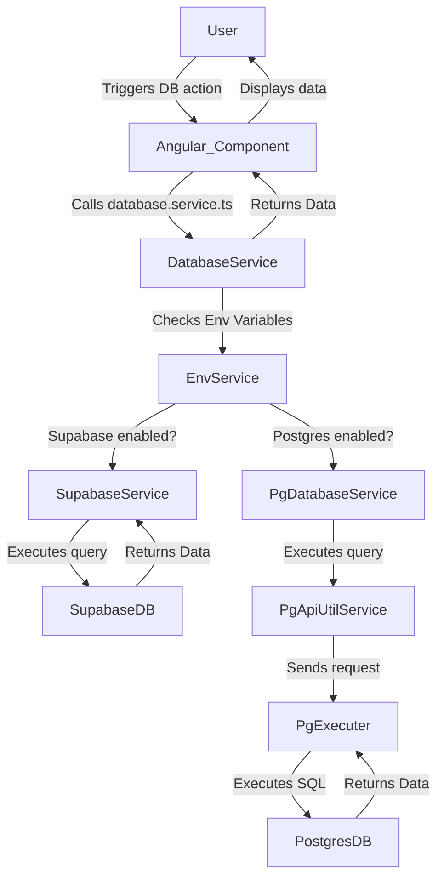

Domain Locker supports both **Supabase** and **PostgreSQL** as database backends. The application dynamically selects which to use based on the configured environment variables. This guide explains how the database integration works, the request flow, and how to interact with the database.

### Database Options

Domain Locker determines the database type by checking the available environment variables:
- If **Supabase** credentials (`SUPABASE_URL`, `SUPABASE_ANON_KEY`) are set, the app uses Supabase.
- If **PostgreSQL** credentials (`DL_PG_HOST`, `DL_PG_USER`, etc.) are set instead, it will use PostgreSQL.
- Managed instances default to Supabase, whereas self-hosted instances default to PostgreSQL.

The entry point for database operations is [`database.service.ts`](https://github.com/Lissy93/domain-locker/blob/main/src/app/services/database.service.ts), which forwards calls to the appropriate database service.

### Database Setup
_(Coming soon...)_

### How the Database Files Fit Together

Database interactions are managed through multiple services:

1. **[`database.service.ts`](https://github.com/Lissy93/domain-locker/blob/main/src/app/services/database.service.ts)**  
   - Determines the active database type (Supabase/Postgres) and routes calls to the correct sub-service.
2. **[`sb-database.service.ts`](https://github.com/Lissy93/domain-locker/blob/main/src/app/services/db-query-services/sb-database.service.ts)** (for Supabase)  
   - Handles queries using the Supabase client.
3. **[`pg-database.service.ts`](https://github.com/Lissy93/domain-locker/blob/main/src/app/services/db-query-services/pg-database.service.ts)** (for PostgreSQL)  
   - Executes queries via the **Postgres API executor**.
4. **[`db-query-services`](https://github.com/Lissy93/domain-locker/tree/main/src/app/services/db-query-services/)**  
   - Contains sub-services for specific parts of the app, e.g., tags, domains, billing.
5. **[`db-proxy.factory.ts`](https://github.com/Lissy93/domain-locker/blob/main/src/app/utils/db-proxy.factory.ts)**  
   - Restricts write operations based on feature flags (e.g., disabling edits on a demo instance).
6. **[`pg-api.util.ts`](https://github.com/Lissy93/domain-locker/blob/main/src/app/utils/pg-api.util.ts)**  
   - Sends SQL queries to the Postgres API.
7. **[`pg-executer.ts`](https://github.com/Lissy93/domain-locker/blob/main/src/server/routes/pg-executer.ts)**  
   - A server route that executes raw SQL queries for Postgres.

### Request Flow



### Using the Database in Code

#### Writing a New Query (Postgres & Supabase)

To add a new query, define it in the appropriate query service.

PostgreSQL example from ([`db-tags.service.ts`](https://github.com/Lissy93/domain-locker/blob/main/src/app/services/db-query-services/pg/db-tags.service.ts))
```ts
addTag(tag: Omit<Tag, 'id'>): Observable<Tag> {
  const query = \`INSERT INTO tags (name, color, icon, description, user_id) VALUES ($1, $2, $3, $4, $5) RETURNING *\`;
  const params = [tag.name, tag.color || null, tag.icon || null, tag.description || null];
  return from(this.pgApiUtil.postToPgExecutor(query, params)).pipe(
    map(response => response.data[0] as Tag),
    catchError(error => this.handleError(error))
  );
}
```

Supabase example from ([`db-tags.service.ts`](https://github.com/Lissy93/domain-locker/blob/main/src/app/services/db-query-services/sb/db-tags.service.ts))

```ts
addTag(tag: Omit<Tag, 'id'>): Observable<Tag> {
  return from(this.supabase.from('tags').insert(tag).single()).pipe(
    map(({ data, error }) => {
      if (error) throw error;
      if (!data) throw new Error('Failed to add tag');
      return data as Tag;
    }),
    catchError(error => this.handleError(error))
  );
}
```

#### Consuming a Query in an Angular Component

```diff
  import { Component } from '@angular/core';
  import { CommonModule } from '@angular/common';
+ import DatabaseService from '~/app/services/database.service';

  @Component({
    standalone: true,
    selector: 'app-example',
    template: \`
      <p>Tags: {{ tags | json }}</p>
    \`,
    imports: [CommonModule],
  })
  export class ExampleComponent {
+   tags: any[] = [];

+   constructor(private databaseService: DatabaseService) {}

+   ngOnInit() {
+     this.databaseService.instance.tagQueries.getTags().subscribe((tags) => {
+       this.tags = tags;
+     });
+   }
  }
```

### Additional Notes

- Queries should be **added to the correct query service** ([`db-tags.service.ts`](https://github.com/Lissy93/domain-locker/blob/main/src/app/services/db-query-services/pg/db-tags.service.ts), [`db-domains.service.ts`](https://github.com/Lissy93/domain-locker/blob/main/src/app/services/db-query-services/pg/db-domains.service.ts), etc.).
- Use **Observables** (`rxjs`) for async operations.
- **Errors should be handled** via `handleError()`, which logs errors and prevents crashes.
- **Postgres uses the API executor**, so queries must be structured correctly to be executed remotely.
- **Use feature flags** to control write operations (see [`db-proxy.factory.ts`](https://github.com/Lissy93/domain-locker/blob/main/src/app/utils/db-proxy.factory.ts)).


