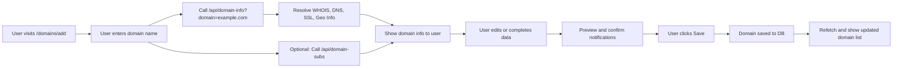
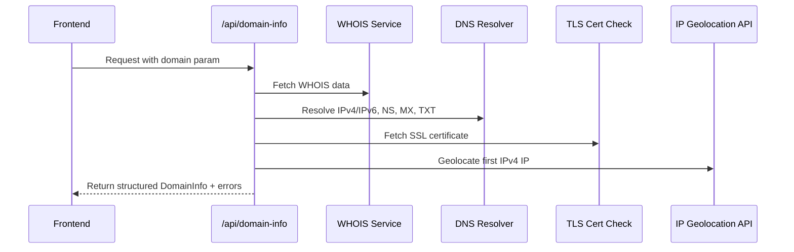

## Overview
User's can add domain to their account by visiting the [`/domains/add`](https://domain-locker.com/domains/add) route.
This will attempt to auto-fetch domain info (see below) and subdomains, and let the user add or edit any fields before saving.


---

## Logic

### User Flow



### API Sequence



---

## Editing

### Current Endpoint
The current logic is handled in [`./src/server/routes/domain-info.ts`](https://github.com/Lissy93/domain-locker/blob/main/src/server/routes/domain-info.ts)

This is a h3 endpoint, see the [API Endpoints](https://domain-locker.com/about/developing/api-endpoints) docs for more details.

### Using your own API
You can create your own API or endpoint to handle the fetching of domain information. Then set the `DL_DOMAIN_INFO_API` environment variable to point to your API endpoint. This will allow you to use your own logic, custom WHOIS/RDAP servers, or alternate methods for finding domain information. Be sure the response matches the expected format described below.


### Response type

See [`./src/types/DomainInfo.ts`](https://github.com/Lissy93/domain-locker/blob/main/src/types/DomainInfo.ts) for the typings.


The response will look something like this:

```json
{
  "domainName": "example.com",
  "status": ["active", "clientTransferProhibited"],
  "ip_addresses": {
    "ipv4": ["93.184.216.34"],
    "ipv6": ["2606:2800:220:1:248:1893:25c8:1946"]
  },
  "dates": {
    "expiry_date": "2025-12-31T23:59:59Z",
    "updated_date": "2024-12-01T12:34:56Z",
    "creation_date": "1995-08-13T00:00:00Z"
  },
  "registrar": {
    "name": "Example Registrar, Inc.",
    "id": "123",
    "url": "https://example-registrar.com",
    "registryDomainId": "D123456789-COM"
  },
  "whois": {
    "name": "John Doe",
    "organization": "Example Corp",
    "street": "1234 Example Blvd",
    "city": "Exampleville",
    "country": "US",
    "state": "CA",
    "postal_code": "90210"
  },
  "abuse": {
    "email": "abuse@example-registrar.com",
    "phone": "+1.5555555555"
  },
  "dns": {
    "dnssec": "unsigned",
    "nameServers": ["ns1.example.com", "ns2.example.com"],
    "mxRecords": ["mx1.example.com", "mx2.example.com"],
    "txtRecords": ["v=spf1 include:_spf.example.com ~all"]
  },
  "ssl": {
    "issuer": "Let's Encrypt",
    "issuer_country": "US",
    "valid_from": "2025-01-01T00:00:00Z",
    "valid_to": "2025-03-31T23:59:59Z",
    "subject": "example.com",
    "fingerprint": "AB:CD:EF:12:34:56:78:90",
    "key_size": 2048,
    "signature_algorithm": "ECDSA"
  },
  "host": {
    "query": "93.184.216.34",
    "country": "US",
    "region": "California",
    "city": "Los Angeles",
    "lat": 34.0522,
    "lon": -118.2437,
    "timezone": "America/Los_Angeles",
    "isp": "ExampleISP",
    "org": "ExampleOrg",
    "asNumber": "AS15133",
    "domain_count": 15,
    "ip": "93.184.216.34"
  },
  "subdomains": [
    {
      "id": "1",
      "domainId": "123",
      "name": "sub.example.com",
      "sd_info": {
        "cname": "example.com"
      }
    }
  ]
}
```

---

## Subdomains API Endpoint

The subdomains are fetched from the [`/api/domain-subs`](https://github.com/Lissy93/domain-locker/blob/main/src/server/routes/domain-subs.ts) endpoint returns subdomains for a given domain.

It's not possible to read dns zone transfer records in Deno on the self-hosted instance, therefore if you want to use this feature, you will need to set up your own API endpoint to fetch subdomains, or make use of a third-party API like Shodan or DNSDumpster.

### Using Third-Party APIs
- To use Shodan, apply for an API key, and then set the `SHODAN_TOKEN` environment variable.
- To use DNSDumpster, purchase a key and set the `DNS_DUMPSTER_TOKEN` environment variable.


## Use your own API
You can create your own API endpoint to fetch subdomains. Set the `DL_DOMAIN_SUBS_API` environment variable to point to your API endpoint. The API should accept a `domain` query parameter and return a JSON response with the following structure:

```json
[
  {
    "subdomain": "smtp-inbound1",
    "tags": [
      "cloud"
    ],
    "type": "A",
    "ip": "40.67.249.73",
    "ports": [
      25
    ],
    "asn": "",
    "asn_name": "",
    "asn_range": "",
    "country": "unknown",
    "country_code": "??",
    "banners": {}
  },
  {
    "id": "1",
    "domainId": "123",
    "name": "sub.example.com",
    "sd_info": {
      "cname": "example.com"
    }
  }
],

```


