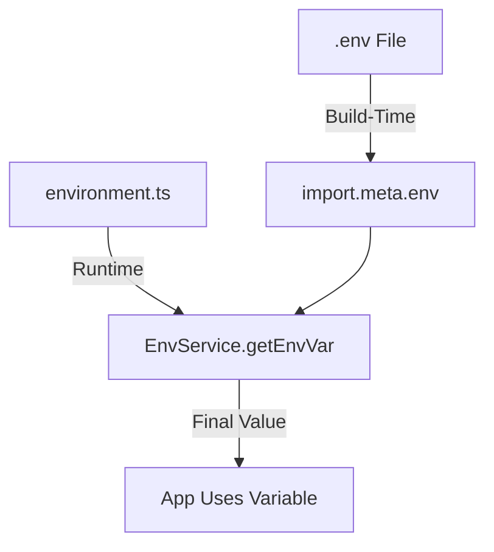

Environment variables allow Domain Locker to be configured dynamically at build-time without modifying the source code. They define settings such as database connections, API keys, analytics, and occasionally feature flags.

The app reads environment variables from:
1. **Build-time variables** (`.env`, `import.meta.env`).
2. **Runtime variables** (`src/environments/environment.ts`).

### How Environment Variables Work

- Any variable prefixed with `DL_` is exposed to the client-side app. This and must not contain sensitive data, because it will be visible in the built bundle.
- Anything secret will need to be read server-side
- The app reads build-time values first, then runtime values, and finally falls back to defaults if no value is found.

---

## Setting Environment Variables

There are multiple ways to set environment variables, depending on the environment:

### Using `.env` Files (Local Development)

```bash
DL_ENV_TYPE=dev
DL_BASE_URL=http://localhost:5173
SUPABASE_URL=https://xyz.supabase.co
SUPABASE_ANON_KEY=your-anon-key
```

### Using a Vault (Production)
_For **secure storage**, use HashiCorp Vault, AWS Secrets Manager, or similar:_

```bash
vault kv put secret/domain-locker DL_BASE_URL="https://app.domainlocker.com"
```

### Setting Directly (Docker/Server)
```bash
export DL_ENV_TYPE=managed
export DL_BASE_URL=https://app.domainlocker.com
```

### Setting in CI/CD Pipelines
When deploying, **add environment variables to production, staging, and other environments**.

For GitHub Actions:
```yaml
env:
  DL_ENV_TYPE: production
  DL_BASE_URL: https://app.domainlocker.com
  SUPABASE_URL: ${{ secrets.SUPABASE_URL }}
```

---

## The Env Service

The most important function in the `EnvService` is `getEnvVar`, which retrieves environment variables from **build-time**, **runtime**, or **fallback values**.

```typescript
const value = this.environmentService.getEnvVar('DL_BASE_URL', 'http://localhost:5173');
```

### How It Works
1. Checks `import.meta.env[key]` (Build-time variable from `.env`).
2. Checks `environment.ts` values (Runtime configuration).
3. Uses fallback if neither is found.
4. Optionally throws an error if no value is set.

### Example: Requiring a Variable

```diff
  import { Component } from '@angular/core';
+ import { EnvService } from '~/app/services/environment.service';

  @Component({
    standalone: true,
    selector: 'app-example',
    template: \`
      <p>API Endpoint: {{ domainSubsEndpoint }}</p>
    \`,
  })
  export class ExampleComponent {
+   constructor(private envService: EnvService) {}

+   domainSubsEndpoint = this.envService.getEnvVar('DL_DOMAIN_SUBS_API', 'https://fallback.example.com');
  }
```

---

## Other Helper Functions for Env Vars

In addition to `getEnvVar`, the `EnvService` provides **specific functions** for commonly used variables:

```typescript
const envType = this.environmentService.getEnvironmentType(); // 'dev', 'managed', etc.
const isSupabaseEnabled = this.environmentService.isSupabaseEnabled(); // true/false
const postgresConfig = this.environmentService.getPostgresConfig(); // { host, port, user, password }
const plausibleConfig = this.environmentService.getPlausibleConfig(); // { site, url, isConfigured }
```

---

## Environment Type (`DL_ENV_TYPE`)

The **environment type** determines how the app behaves and what features are enabled.

| Value | Description |
|--------|------------|
| `dev` | Development mode, enables debugging, local APIs. |
| `managed` | Hosted SaaS version, includes billing and multi-user features. |
| `selfHosted` | Self-hosted instance, excludes Supabase and external services. |
| `demo` | Read-only mode with pre-filled data. |

This value is used by **FeatureService** to dynamically enable or disable features.

---

## List of Allowed Environment Variables

| Variable | Description | Required? |
|----------|------------|-----------|
| `DL_ENV_TYPE` | The environment type (`dev`, `managed`, `selfHosted`, `demo`). | ✅ |
| `DL_BASE_URL` | Hostname or URL where Domain Locker is running. | ✅ |
| `SUPABASE_URL` | Supabase project URL. | ❌ (Only for managed) |
| `SUPABASE_ANON_KEY` | Supabase public API key. | ❌ (Only for managed) |
| `DL_SUPABASE_PROJECT` | Supabase project ID. | ❌ |
| `DL_GLITCHTIP_DSN` | GlitchTip DSN (for error tracking). | ❌ |
| `DL_PLAUSIBLE_URL` | Plausible instance URL (for analytics). | ❌ |
| `DL_PLAUSIBLE_SITE` | Plausible site ID. | ❌ |
| `DL_PG_HOST` | PostgreSQL database hostname. | ✅ (Self-hosted) |
| `DL_PG_PORT` | PostgreSQL database port. | ✅ (Self-hosted) |
| `DL_PG_NAME` | PostgreSQL database name. | ✅ (Self-hosted) |
| `DL_PG_USER` | PostgreSQL username. | ✅ (Self-hosted) |
| `DL_PG_PASSWORD` | PostgreSQL password. | ✅ (Self-hosted) |
| `DL_DEMO_USER` | Demo user email. | ❌ (Demo mode only) |
| `DL_DEMO_PASS` | Demo user password. | ❌ (Demo mode only) |
| `DL_DOMAIN_INFO_API` | API endpoint for domain info (`/api/domain-info`). | ✅ |
| `DL_DOMAIN_SUBS_API` | API endpoint for domain subscription data. | ✅ |
| `DL_STRIPE_CHECKOUT_URL` | Stripe checkout session creation URL. | ❌ |
| `DL_STRIPE_CANCEL_URL` | Stripe subscription cancellation URL. | ❌ |

---

## How Environment Variables Flow in the App


