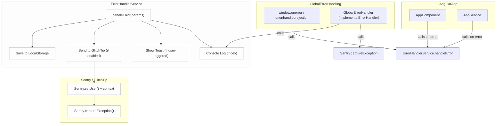

The `ErrorHandlerService` is a centralized utility for handling errors in the Domain Locker app. It supports logging errors to the console, displaying error messages to users via toasts, and reporting errors to GlitchTip (if enabled). All errors should go through the error handler, so they can be managed consistently. 

### How to Use

1. **Import the `ErrorHandlerService`:**
```typescript
import { ErrorHandlerService } from '~/app/services/error-handler.service';
```

2. **Inject it into a Component or Service:**
```typescript
constructor(private errorHandler: ErrorHandlerService) {}
```

3. **Call the `handleError` Method:**

```typescript
   try {
     // Code that might throw an error
   } catch (error) {
     this.errorHandler.handleError({
       error, // Pass the caught error
       message: 'Failed to perform operation', // Friendly message for users
       showToast: true, // Show a toast notification to the user
       location: 'exampleComponent.someFunction', // Optional: where the error occurred
     });
   }
```

### Example: Full Implementation

```diff
  import { Component } from '@angular/core';
+ import { ErrorHandlerService } from '~/app/services/error-handler.service';

  @Component({
    selector: 'app-example',
    templateUrl: './example.component.html',
    styleUrls: ['./example.component.scss'],
  })
  export class ExampleComponent {
+   constructor(private errorHandler: ErrorHandlerService) {}

    exampleFunction() {
      try {
        // Code that might throw an error
      } catch (error) {
+       this.errorHandler.handleError({
+         error,
+         message: 'An error occurred while performing the operation.',
+         showToast: true,
+         location: 'ExampleComponent.exampleFunction',
+       });
      }
    }
  }
```


### Notes
- To use Glitchtip or Sentry for error tracking, you'll needs to set the `DL_GLITCHTIP_DSN` environment variable.
- Use the `showToast` option sparingly to avoid overwhelming users with error messages.
- If you are displaying toast to the user, try and set a helpful `message` as well. Where possible, provide `location`, to make tracking and debugging easier.
- When `DL_ENV_TYPE` env var is set to dev, then errors will also be shown in the browser console.


### Flow


