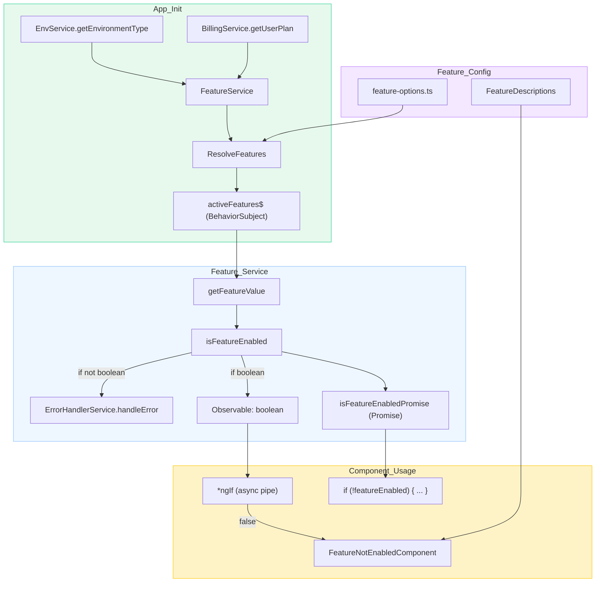

Feature flagging allows you to enable or disable specific features based on the user's environment (managed or self-hosted) and billing plan. This section covers:

1. How to enable/disable an existing feature.
2. How to add a new feature for flagging.
3. How to show a placeholder when a feature is unavailable.

### Enabling/Disabling an Existing Feature

To enable or disable a feature, use the `FeatureService` and the `isFeatureEnabled` method. Here's an example of adding a conditional check for a feature in the navbar:

```diff
  <a routerLink="/settings" *ngIf="isAuthenticated">
-   <button pButton icon="pi pi-wrench" label="Settings"></button>
+   <button
+     pButton
+     icon="pi pi-wrench"
+     label="Settings"
+     *ngIf="isAuthenticated && (settingsEnabled$ | async)"
+   ></button>
  </a>
```

In the corresponding component:

```diff
+ import { FeatureService } from '~/app/services/features.service';

  export class NavbarComponent {
+   settingsEnabled$ = this.featureService.isFeatureEnabled('accountSettings');

    constructor(
+     private featureService: FeatureService
    ) {}
  }
```

### Adding a New Feature for Flagging

To add a new feature:

1. **Update the `features` Configuration**: Add the feature to `src/app/constants/feature-options.ts`:

```diff
  export const features: FeatureDefinitions = {
+   newFeature: {
+     default: false,
+     managed: {
+       free: false,
+       pro: true,
+       enterprise: true,
+     },
+     selfHosted: true,
+   },
  };
```

2. **Add a Description**: Update `featureDescriptions` to include a label and description:

```diff
  export const featureDescriptions: Record<keyof FeatureDefinitions, { label: string; description: string }> = {
+   newFeature: {
+     label: 'New Feature',
+     description: 'This is a description of the new feature.',
+   },
  };
```

3. **Use the Feature in Components**: Use the `FeatureService` to check if the feature is enabled:

```typescript
newFeatureEnabled$ = this.featureService.isFeatureEnabled('newFeature');
```

### Showing a Placeholder for Unavailable Features

If a feature is unavailable, use the `FeatureNotEnabledComponent` to display a message to the user:

```typescript
import { Component } from '@angular/core';
import { CommonModule } from '@angular/common';
import { FeatureNotEnabledComponent } from '~/app/components/misc/feature-not-enabled.component';

@Component({
  standalone: true,
  selector: 'app-example-component',
  imports: [CommonModule, FeatureNotEnabledComponent],
  template: \`
    <ng-container *ngIf="featureEnabled$ | async; else featureNotAvailable">
      <p>The feature is enabled and functional.</p>
    </ng-container>
    <ng-template #featureNotAvailable>
      <app-feature-not-enabled feature="newFeature"></app-feature-not-enabled>
    </ng-template>
  \`,
})
export class ExampleComponent {
  featureEnabled$ = this.featureService.isFeatureEnabled('newFeature');

  constructor(private featureService: FeatureService) {}
}
```

The `FeatureNotEnabledComponent` automatically determines the reason a feature is unavailable and shows a tailored message.

### Enabling/Disabling a Feature in TS

It's easier to use Promises instead of Observables when feature flagging something in the Typescript code.
For this, we can use the `isFeatureEnabledPromise` method instead.

```typescript
if (!(await this.featureService.isFeatureEnabledPromise('writePermissions'))) {
  this.globalMessagingService.showWarn(
    Write Permissions Disabled',
      'It\'s not possible to add subdomains on the demo instance.',
  );
  return;
}
```

### Notes

- **Dynamic Feature Updates**: Features are resolved reactively based on user plan and environment.
- **Default Behavior**: Features without specific configuration fallback to the `default` value.
- **Error Logging**: If a feature's value cannot be resolved correctly, an error is logged, and the feature is disabled.


