## Installing Postgres

### Option 1: System

First, install Postgres for your OS if you haven't already done so.

On Debian/Ubuntu/WSL you can run `apt install postgresql`, for other distros or operating systems, you can download it from [here](https://www.postgresql.org/download/).

You should now have access to the `psql` CLI tool, and you can verify that the postgresql service is running with `systemctl status postgresql`.

### Option 2: Docker
You can also run Postgres in a Docker container, instead of directly on your host system

```bash
docker run -d \
  --name domain-locker-db \
  -e POSTGRES_USER=postgres \
  -e POSTGRES_PASSWORD=your-password \
  -e POSTGRES_DB=domain_locker \
  -p 5432:5432 \
  postgres:15
```

Where `POSTGRES_USER` is the username (e.g. `postgres`), `POSTGRES_PASSWORD` is your preferred password, `POSTGRES_DB` is the default database name that will be created, and `postgres:15` is the Docker image (version 15).

You can then connect to the database from Domain Locker by setting your env vars (in `.env` or wherever):

```bash
DL_PG_HOST=localhost
DL_PG_PORT=5432
DL_PG_NAME=domain_locker
DL_PG_USER=postgres
DL_PG_PASSWORD=your-password
```

### Option 3: Managed

If you prefer cloud-managed solutions, popular providers include:
- Amazon RDS
- Google Cloud SQL
- Azure Database for PostgreSQL
- Neon

In each case, you’d retrieve the connection details (hostname, port, credentials) from the provider’s console and set your Domain Locker environment variables accordingly.

---

## Configuring the Schema

We've got a Bash script in [`./db/setup-postgres.sh`](https://github.com/Lissy93/domain-locker/blob/main/db/setup-postgres.sh) which will take care of creating your database and applying the Domain Locker schema.

---

## Schema

The schema can be found in [`db/schema.sql`](https://github.com/Lissy93/domain-locker/blob/main/db/schema.sql).

```mermaid
classDiagram
  class users {
    uuid id
    text email
    timestamp created_at
    timestamp updated_at
  }

  class domains {
    uuid id
    uuid user_id
    text domain_name
    date expiry_date
    text notes
    timestamp created_at
    timestamp updated_at
    uuid registrar_id
    timestamp registration_date
    timestamp updated_date
  }

  class registrars {
    uuid id
    text name
    text url
    uuid user_id
  }

  class tags {
    uuid id
    text name
    text color
    text description
    text icon
    uuid user_id
  }

  class domain_tags {
    uuid domain_id
    uuid tag_id
  }

  class notifications {
    uuid id
    uuid user_id
    uuid domain_id
    text change_type
    text message
    boolean sent
    boolean read
    timestamp created_at
  }

  class billing {
    uuid id
    uuid user_id
    text current_plan
    timestamp next_payment_due
    text billing_method
    timestamp created_at
    timestamp updated_at
    jsonb meta
  }

  class dns_records {
    uuid id
    uuid domain_id
    text record_type
    text record_value
    timestamp created_at
    timestamp updated_at
  }

  class domain_costings {
    uuid id
    uuid domain_id
    numeric purchase_price
    numeric current_value
    numeric renewal_cost
    boolean auto_renew
    timestamp created_at
    timestamp updated_at
  }

  class domain_hosts {
    uuid domain_id
    uuid host_id
  }

  class domain_links {
    uuid id
    uuid domain_id
    text link_name
    text link_url
    timestamp created_at
    timestamp updated_at
    text link_description
  }

  class domain_statuses {
    uuid id
    uuid domain_id
    text status_code
    timestamp created_at
  }

  class domain_updates {
    uuid id
    uuid domain_id
    uuid user_id
    text change
    text change_type
    text old_value
    text new_value
    timestamp date
  }

  class uptime {
    uuid id
    uuid domain_id
    timestamp checked_at
    boolean is_up
    integer response_code
    numeric response_time_ms
    numeric dns_lookup_time_ms
    numeric ssl_handshake_time_ms
    timestamp created_at
  }

  class ssl_certificates {
    uuid id
    uuid domain_id
    text issuer
    text issuer_country
    text subject
    date valid_from
    date valid_to
    text fingerprint
    integer key_size
    text signature_algorithm
    timestamp created_at
    timestamp updated_at
  }

  class whois_info {
    uuid id
    uuid domain_id
    text country
    text state
    text name
    text organization
    text street
    text city
    text postal_code
  }

  class user_info {
    uuid id
    uuid user_id
    jsonb notification_channels
    timestamp created_at
    timestamp updated_at
    text current_plan
  }

  class hosts {
    uuid id
    inet ip
    numeric lat
    numeric lon
    text isp
    text org
    text as_number
    text city
    text region
    text country
    uuid user_id
  }

  class ip_addresses {
    uuid id
    uuid domain_id
    inet ip_address
    boolean is_ipv6
    timestamp created_at
    timestamp updated_at
  }

  class notification_preferences {
    uuid id
    uuid domain_id
    text notification_type
    boolean is_enabled
    timestamp created_at
    timestamp updated_at
  }

  class sub_domains {
    uuid id
    uuid domain_id
    text name
    timestamp created_at
    timestamp updated_at
    jsonb sd_info
  }

  users --> domains : user_id
  registrars --> domains : registrar_id
  users --> registrars : user_id
  users --> tags : user_id
  domains --> domain_tags : domain_id
  tags --> domain_tags : tag_id
  users --> notifications : user_id
  domains --> notifications : domain_id
  users --> billing : user_id
  domains --> dns_records : domain_id
  domains --> domain_costings : domain_id
  domains --> domain_hosts : domain_id
  hosts --> domain_hosts : host_id
  domains --> domain_links : domain_id
  domains --> domain_statuses : domain_id
  domains --> domain_updates : domain_id
  users --> domain_updates : user_id
  domains --> uptime : domain_id
  domains --> ssl_certificates : domain_id
  domains --> whois_info : domain_id
  users --> user_info : user_id
  users --> hosts : user_id
  domains --> ip_addresses : domain_id
  domains --> notification_preferences : domain_id
  domains --> sub_domains : domain_id
```




---

## Advanced

### Secure External Connections

If your database is exposed to the internet, look into:
- **Firewall Rules**: Limit which IPs can connect on port 5432.
- **SSL/TLS**: Configure Postgres to only accept encrypted connections.

### Performance Tuning

For heavy usage, consider tuning:
- **`shared_buffers`**,
- **`work_mem`**,
- **`checkpoint_segments`**,  
and other parameters in `postgresql.conf`.

### Backup and Restore

To create a backup:

```bash
pg_dump -U postgres -h localhost -F c -b -v -f domain_locker_backup.sql
```

Restore it with:

```bash
pg_restore -U postgres -h localhost -d domain_locker -v domain_locker_backup.sql
```

---

## Enable Password Authentication

During development, on locally running Postgres instance, you will likely want to use password authentication setup.

Edit the `pg_hba.conf` file to use `md5` authentication

```bash
sudo nano /etc/postgresql/<version>/main/pg_hba.conf
```
	
And make the following edit:

```diff
- local   all             postgres                                peer
+ local   all             postgres                                md5
```

Also, don't forget to ensure `md5` is set for any `host` entries:

```
host    all             all             127.0.0.1/32            md5
host    all             all             ::1/128                 md5
```

Then restart Postgres

```bash
sudo systemctl restart postgresql
```

And finally, set a (secure) password for the postgres user

```
sudo -u postgres psql -c "\password postgres"
```

---

## Troubleshooting

- **Check logs** in `/var/log/postgresql/` (for Debian-based systems).
- **Verify running processes**: `sudo systemctl status postgresql`
- **Connection errors**: Confirm your env vars are correct (host, port, user, password).
