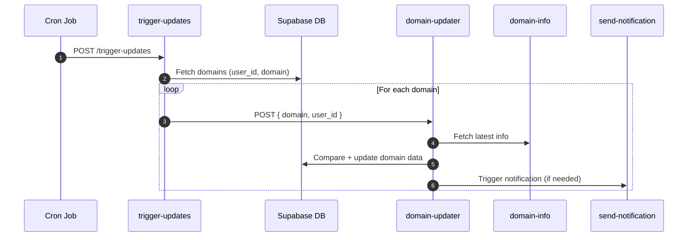
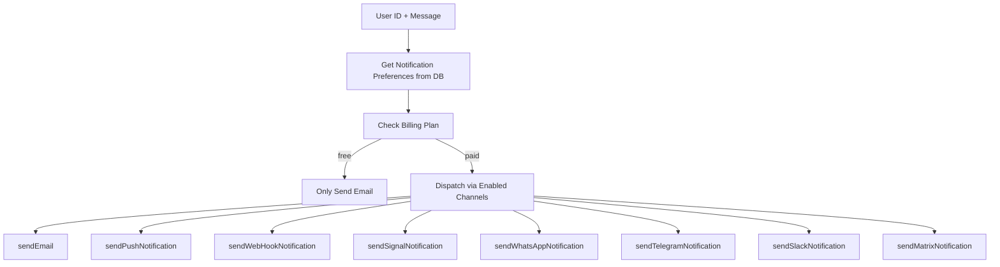
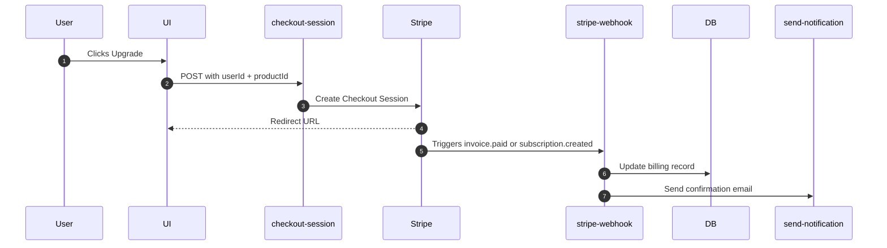
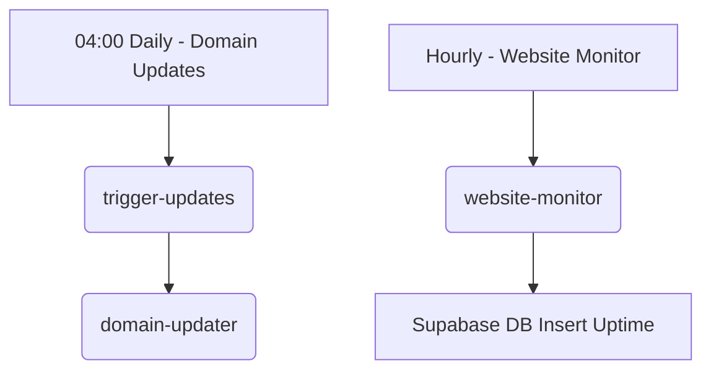
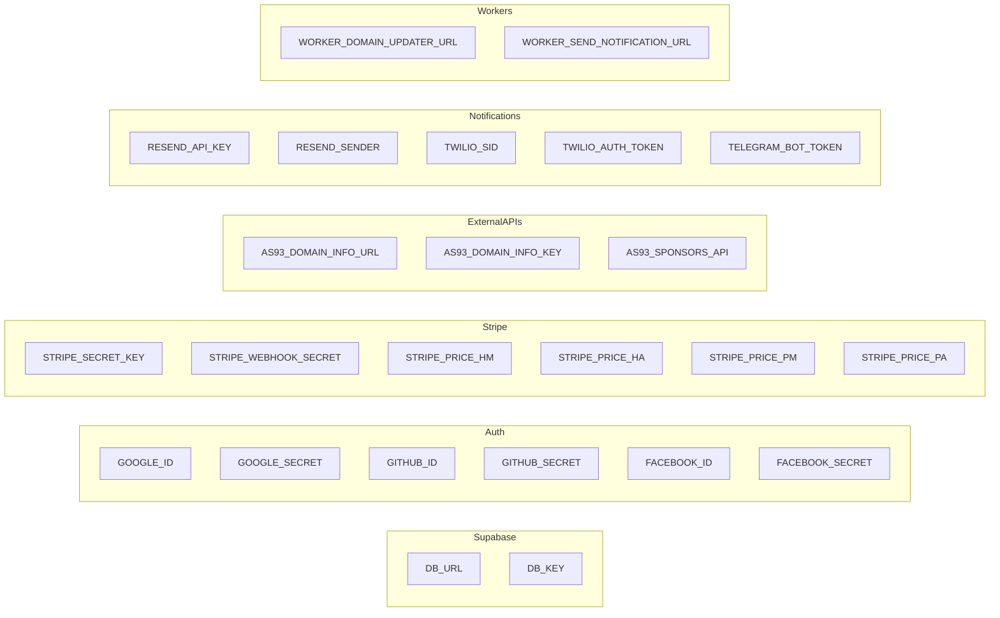

The code for the Supabase setup is at [github.com/Lissy93/dl-sb-iac](https://github.com/Lissy93/dl-sb-iac).
This covers the config, schema, templates, migrations as well as all serverless functions, and is automated with GitHub Actions.

We use Supabase on the managed instance, for it's PostgresDB, auth handling and serverless functions.

<blockquote class="markdown-alert markdown-alert-note">
	
[!NOTE]<br>
Setting up Supabase for the first time can be quite tricky, and we cannot offer support for it.<br>
There is also some reliance on non-free third-parties, such as Google, Twilio, Resend, Turnstile and Stripe.<br>
<b>Where possible, we recommend self-hosted user to use Postgres instead.</b>
</blockquote>

---

### File Structure

```
dl-sb-iac/
├─ supabase/
│  ├─ functions/    # Deno Edge functions
│  ├─ migrations/   # Database schema
│  ├─ templates/    # Mailer templates
│  ╰─ config.toml   # Supabase configuration
├─ .github/         # Repo admin, and GH Actions
│  ├─ workflows/    # CI/CD files for deployment
│  ╰─ README.txt    # Documentation
├─ Makefile         # Project commands
├─ deno.json        # Deno project config
╰─ .gitignore       # Stuff to not commit
```

---

### Developing

#### Pre-requisites:
  - Install Git, Deno, Supabase CLI, Postgres and Docker on your local machine
  - Deploy a Supabase instance. See https://supabase.io/docs/guides/self-hosting
  - Configure all the required environmental variables for services (see below)

#### Project setup:
- `git clone git@github.com:Lissy93/dl-sb-iac.git`
- `supabase link --project-ref PROJECT_REF`

#### Development:
- `supabase start`
- `supabase status`
- `supabase functions serve`

---

### Deploying

#### Manual Deploy
- `supabase secrets set-from-env` - _Set environments_
- `supabase config push` - _Apply configuration_
- `supabase db push` -  _Deploy schema_
- `supabase functions deploy` - _Deploy functions_

See the [`Makefile`](https://github.com/Lissy93/dl-sb-iac/blob/main/Makefile) for all deployment commands.

#### Automated Deploy
The easiest way to deploy is via GitHub Actions, which we use for CI/CD.<br>
Just fork the repo, enable actions, set the env vars, and push to main.<br>
This will trigger the [`supabase.yml`](https://github.com/Lissy93/dl-sb-iac/blob/main/.github/workflows/supabase.yml) workflow, which will deploy the project.

You'll need to configure the following GitHub secrets to authenticate:
- `SUPABASE_PROJECT_ID` - _The Supabase project ID_
- `SUPABASE_ACCESS_TOKEN` - _The Supabase access token_
- `SUPABASE_DB_PASSWORD` - _The Postgres password for your Supabase DB_
- `SUPABASE_ENV_FILE` - _Raw text env vars for all else you need (see below)_

---

### Edge Functions

| **Category**         | **Function**           | **Description**                                                                 |
|-----------------------|------------------------|---------------------------------------------------------------------------------|
| **Stripe and Billing**| `cancel-subscription` | Cancels a user's subscription                                                  |
|                       | `checkout-session`    | Creates a new checkout session for a subscription                              |
|                       | `stripe-webhook`      | Handles incoming events triggered from Stripe                                  |
|                       | `new-user-billing`    | Adds a billing record for new users + checks if sponsor                        |
| **User Management**   | `delete-account`      | Deletes a user account and all associated data                                 |
|                       | `export-data`         | Exports all (selected) data for a user in a given format                       |
| **Domain Management** | `trigger-updates`     | Selects all domains for users, and triggers domain-updater                     |
|                       | `domain-updater`      | Updates domains with latest info, triggers notifications                       |
|                       | `send-notification`   | Sends a notification to user id with message                                   |
|                       | `website-monitor`     | Gets response info for each (pro) domain, updates db                           |
| **Info Routes**       | `domain-info`         | Fetches all info for any given domain name                                     |
|                       | `domain-subs`         | Fetches all subdomains for any given domain                                    |

---

### Crons

| **Schedule** | **Nodename** | **Nodeport** | **Database** | **Username** | **Job Name**               | **Endpoint**                                                   |
|--------------|--------------|--------------|--------------|--------------|----------------------------|----------------------------------------------------------------|
| 0 4 * * *    | localhost    | 5432         | postgres     | postgres     | run_domain_update_job      | https://[supabase-instance]/functions/v1/trigger-updates      |
| 0 * * * *    | localhost    | 5432         | postgres     | postgres     | run_website_monitor_job    | https://[supabase-instance]/functions/v1/website-monitor      |


---

### Environmental Variables

| **Category**         | **Variable**                          | **Description**                                      |
|-----------------------|---------------------------------------|-----------------------------------------------------|
| **Supabase**          | `DB_URL`                             | The URL to your Supabase instance and project        |
|                       | `DB_KEY`                             | The anon key to your new Supabase project            |
| **Authentication**    | `SUPABASE_AUTH_EXTERNAL_GOOGLE_CLIENT_ID`   | Google OAuth Client ID                        |
|                       | `SUPABASE_AUTH_EXTERNAL_GOOGLE_SECRET`      | Google OAuth Secret                           |
|                       | `SUPABASE_AUTH_EXTERNAL_FACEBOOK_CLIENT_ID` | Facebook OAuth Client ID                      |
|                       | `SUPABASE_AUTH_EXTERNAL_FACEBOOK_SECRET`    | Facebook OAuth Secret                         |
|                       | `SUPABASE_AUTH_EXTERNAL_GITHUB_CLIENT_ID`   | GitHub OAuth Client ID                        |
|                       | `SUPABASE_AUTH_EXTERNAL_GITHUB_SECRET`      | GitHub OAuth Secret                           |
| **API Endpoints**     | `AS93_DOMAIN_INFO_URL`               | The URL to our external domain info API              |
|                       | `AS93_DOMAIN_INFO_KEY`               | The key for the domain info API                      |
|                       | `AS93_SPONSORS_API`                  | The URL to our GitHub sponsors API                   |
| **Worker Endpoints**  | `WORKER_DOMAIN_UPDATER_URL`          | The URL to domain-updater function                   |
|                       | `WORKER_SEND_NOTIFICATION_URL`       | The URL to send-notification function                |
| **Stripe**            | `STRIPE_SECRET_KEY`                  | Stripe secret key (starting with sk_live_ or sk_test_) |
|                       | `STRIPE_WEBHOOK_SECRET`              | Stripe webhook secret (starting with whsec_)         |
| **Stripe Prices**     | `STRIPE_PRICE_HM`                    | Stripe price ID for the hobby monthly plan (starting price_) |
|                       | `STRIPE_PRICE_HA`                    | Price ID for the hobby annual plan                   |
|                       | `STRIPE_PRICE_PM`                    | Price ID for the pro monthly plan                    |
|                       | `STRIPE_PRICE_PA`                    | Price ID for the pro annual plan                     |
| **Resend**            | `RESEND_API_KEY`                     | The API key for the Resend service (send access)     |
|                       | `RESEND_SENDER`                      | The sender email for Resend                          |
| **Twilio**            | `TWILIO_SID`                         | Twilio account SID                                   |
|                       | `TWILIO_AUTH_TOKEN`                  | Twilio auth token                                    |
|                       | `TWILIO_PHONE_NUMBER`                | Twilio phone number                                  |
|                       | `TWILIO_WHATSAPP_NUMBER`             | Twilio WhatsApp number                               |
| **Telegram**          | `TELEGRAM_BOT_TOKEN`                 | The token for the telegram notification bot          |

It's advisable to use a secret store for this. We use Supabase Vault.
Or, you can pass secrets to Supabase, by running:
`supabase secrets set --env-file supabase/functions/.env`

---

### Domain Updating Flow



---

### Notification Dispatching Flow


---

### Stripe Billing Lifecycle



---

### Cron Schedules



---

### Environmental Config



---

### Support for Supabase
We can not provide support for this codebase. It is provided as-is.
If you need help, please refer to the official docs for the services used.
We are not accepting feature requests or bug reports (except security issues) either.

The difficulty of deploying this project is graded at moderate to hard
You'll need a solid understanding of Deno, Supabase, Postgres and Docker

It is also possible to run Domain Locker without Supabase, using Postgres only, which is recommended.

