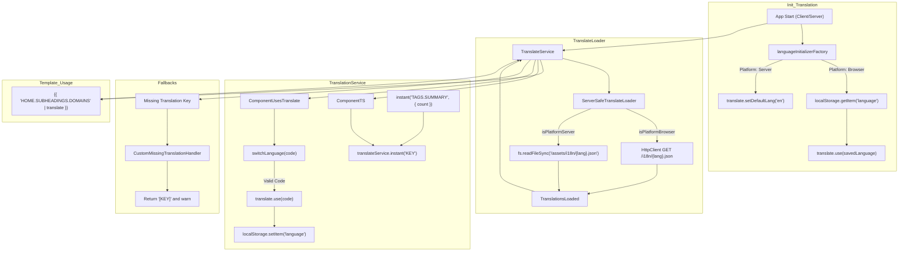

The Domain Locker app uses `ngx-translate` for translations, enabling multi-language support. This section explains how to implement translations in your components, use translations in TypeScript files, and add new languages.

### Using Translations in Components

To use translations in a component, import the `TranslateModule` and add it to the component's imports:

```typescript
import { TranslateModule } from '@ngx-translate/core';
```

#### Example: Inline Template

Here is a minimal example of using translations in a template:

```typescript
@Component({
  selector: 'app-language-switcher',
  standalone: true,
  imports: [TranslateModule],
  template: `
    <div>
      <label *ngFor="let lang of languages">
        <input
          type="radio"
          [value]="lang.code"
          [(ngModel)]="selectedLanguage"
          (change)="onLanguageChange(lang.code)"
        />
        {{ lang.flag }} {{ lang.name }}
      </label>
    </div>
  `,
})
export class LanguageSwitcherComponent {
  languages = [
    { code: 'en', name: 'English', flag: '🇬🇧' },
    { code: 'de', name: 'Deutsch', flag: '🇩🇪' },
  ];
  selectedLanguage = 'en';

  constructor(private translationService: TranslationService) {}

  onLanguageChange(langCode: string) {
    this.translationService.switchLanguage(langCode);
  }
}
```

### Using Translations in HTML

To translate strings in HTML, use the `translate` pipe:

```html
<h2>{{ 'HOME.SUBHEADINGS.DOMAINS' | translate }}</h2>
```


### Using Translations in TypeScript

To translate strings in TypeScript, use the `TranslationService`:

```typescript
constructor(private translationService: TranslationService) {}

someFunction() {
  const translatedText = this.translationService.translateService.instant('HOME.SUBHEADINGS.DOMAINS');
  console.log(translatedText); // Outputs the translated string
}
```

#### Example with Parameters

You can pass dynamic parameters to translations:

```typescript
const message = this.translationService.translateService.instant('TAGS.SUMMARY', { count: 5 });
console.log(message); // Outputs: "Showing 5 tags -"
```

### Adding a New Language

1. **Create a Language File**: Add a new file for the language in `src/assets/i18n/`. For example, for German, create `de.json`:

```json
{
  "NAV": {
    "DOMAINS": "Domains",
    "INVENTORY": "Inventar"
  },
  "HOME": {
    "SUBHEADINGS": {
      "DASHBOARD": "Dashboard",
      "DOMAINS": "Domains"
    }
  }
}
```

2. **Update the `availableLanguages` Array**: Add the new language to the `TranslationService`:

```diff
  availableLanguages = [
    { code: 'en', name: 'English', flag: '🇬🇧' },
+   { code: 'de', name: 'Deutsch', flag: '🇩🇪' }
  ];
```

3. **Test the Language**: Switch to the new language using the language switcher or by appending `?lang=de` to the URL.

### Notes

- **Dynamic Language Switching**: Changes take effect immediately after calling `switchLanguage`.
- **Fallback Mechanism**: Missing translations return the key wrapped in square brackets (e.g., `[MISSING.KEY]`).
- **Default Language**: Ensure a default language (`en`) is always available in `TranslationService`.


